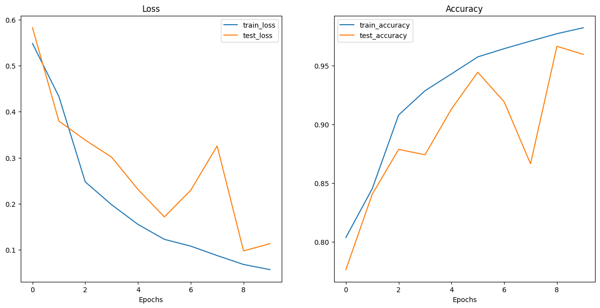
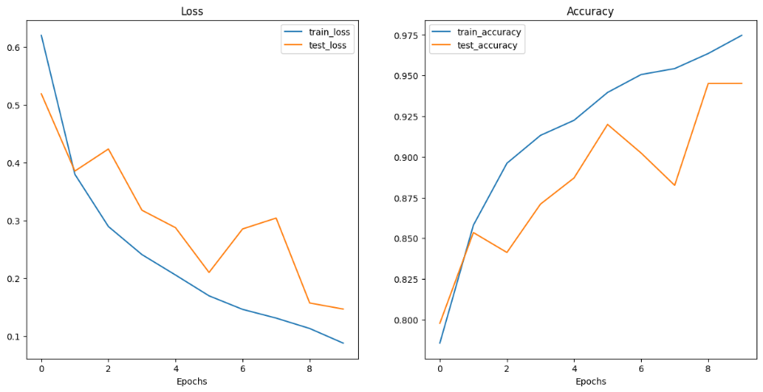
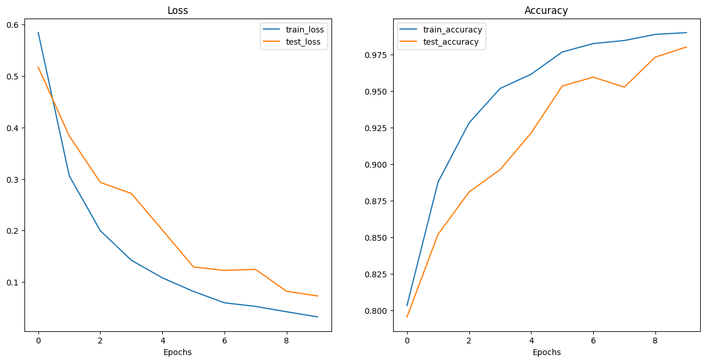
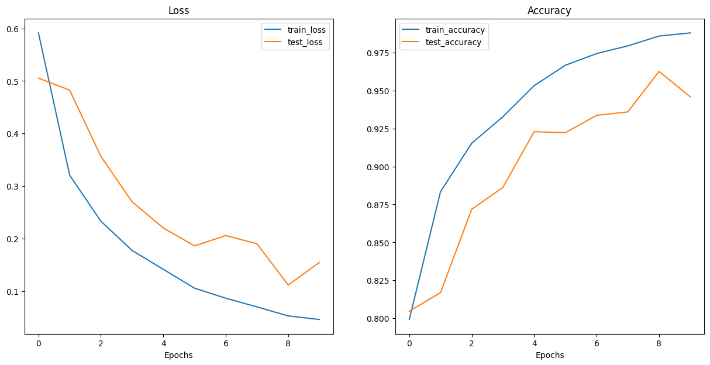

# Project description :
In this project I wanted to create a hybrid model. I will call a hybrid model a model whcih is created by combining 2 models, one pretrained and one who is not trained

Our dataset consists of 4 different types of brain tumours:

- glioma
- meningioma
- notumor
- pituitary

*The scope of this project is an educational one showing how we can use pretrained models to suit everyday problems by simply adding extra layers to the model*
## The architecture I used:
For this project I tried 4 different architectures from the `torchvision.models`  subpackage  which contains different models.
## Parameters for each architecture:
The results may vary because of the number of parameters in each architecture.

### Parameters of the models:
| Model | Total Params | Trainable Params | Non-Trainable Params |
|---|---|---|---|
| ResNet50 | 30,433,156 | 6,925,124 | 23,508,032 |
| AlexNet | 7,379,588 | 4,909,892 | 2,469,696 |
| Mobile Net V3 Large | 9,270,388 | 6,298,436 | 2,971,952 |
| VGG16 | 20,755,076 | 6,040,388 | 14,714,688 |
## The results
### Average results after 10 epochs:
| Model | Average Train Loss | Average Train Loss | Average train accuracy | Average test accuracy: |
|---|---|---|---|---|
| ResNet50 | 0.20250 | 0.27704 | 92.81% | 89.39% |
| AlexNet | 0.23858 | 0.30378 | 91.58% | 88.46% |
| Mobile Net V3 Large | 0.16091 | 0.21982 | 94.55% | 91.65% |
| VGG16 | 0.18284 | 0.26854 | 93.78% | 90.03% |
### Last results after 10 epcohs
| Model | Last Train Loss | Last Train Loss | Last train accuracy | Last test accuracy: |
|---|---|---|---|---|
| ResNet50 | 0.05689 | 0.11317 | 98.22% | 95.96% |
| AlexNet | 0.08813 | 0.14701 | 97.47% | 94.51% |
| Mobile Net V3 Large | 0.03236 | 0.07299 | 99.00% | 98.02% |
| VGG16 | 0.04643 | 0.15485 | 98.80% | 94.59% |
### Graphs for the train loss and the test loss :
- ResNet50
  
- AlexNet
  
- Mobile Net V3 Large
  
- VGG16
  
